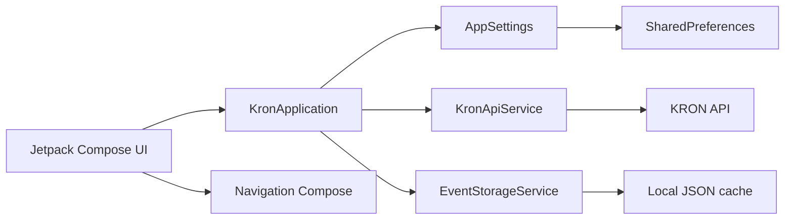

# KRON for Android

Native Android port of the KRON university schedule application, built with **Kotlin** and **Jetpack Compose**.

This repository contains my Android implementation of an existing KRON application. The port was developed against the original product behaviour, reviewed through GitHub, and **merged into the upstream Android repository**.

> **Upstream contribution:** [defaultdino/kron-android#1](https://github.com/defaultdino/kron-android/pull/1)
>
> **Canonical upstream repository:** [defaultdino/kron-android](https://github.com/defaultdino/kron-android)

## What I built

I ported the application's core schedule workflow to Android and took it from an initial repository skeleton to a working Kotlin/Compose MVP.

The implementation includes:

- university and programme search using the live KRON API
- schedule preview with events grouped by day
- persistent saved schedules
- local event caching for previously loaded schedules
- manual schedule refresh and cache cleanup
- event detail views for time, location and teachers
- light, dark and system appearance modes
- Android navigation with swipe-style transitions
- search-state preservation when navigating between results and schedule previews
- free/full-version product logic limiting the free version to one saved schedule
- clear user feedback when the saved-schedule limit is reached
- English and Spanish Android resources

## Engineering highlights

### Android UI and state

The app uses **Jetpack Compose** for the interface and Compose state / `StateFlow` for reactive application state. Navigation is handled with Navigation Compose, including forward/back swipe-style transitions.

### API integration

`KronApiService` communicates with the KRON backend using **OkHttp** and **Gson**. The networking layer handles:

- university discovery
- programme search
- schedule event retrieval
- HTTP-specific error states
- flexible ISO-8601 timestamp parsing
- correct encoding of schedule IDs containing `+`

### Persistence and offline behaviour

Saved programme metadata is persisted with `SharedPreferences`, while schedule events are stored in a local JSON cache. Cached events can remain available after reopening the app, and stale events are cleaned automatically.

### Product behaviour

The Android implementation does more than reproduce screens. It also ports product rules and interaction details, including saved-schedule limits, refresh behaviour, grouped schedule previews, persistent search state and user guidance around free/full-version restrictions.

## Architecture



## Project structure

```text
app/src/main/java/dev/kron/app/
├── application/
│   ├── KronApplication.kt
│   └── settings/
├── models/network/
├── screens/
│   ├── bookmarks/
│   ├── search/
│   ├── settings/
│   └── other/
├── services/kron/
│   ├── api/
│   └── store/event/
└── ui/theme/
```

## Tech stack

| Area | Technology |
| --- | --- |
| Language | Kotlin |
| UI | Jetpack Compose, Material 3 |
| Navigation | Navigation Compose |
| State | StateFlow, Compose state |
| Networking | OkHttp |
| JSON | Gson |
| Persistence | SharedPreferences, local JSON cache |
| Build | Gradle, Android Gradle Plugin |
| Target | Android SDK 35, min SDK 26 |

## Contribution history

The first working Android port was developed in this fork and submitted upstream through a pull request. The contribution was accepted and merged into the project owner's repository.

The merged work covers the Android application structure, API integration, search and schedule flows, persistence, caching, UI behaviour and subsequent product/UX fixes.

**Merged pull request:** [Port KRON Android app to Kotlin and Jetpack Compose](https://github.com/defaultdino/kron-android/pull/1)

## Run locally

### Requirements

- Android Studio
- JDK 17
- Android SDK compatible with compile SDK 35
- Android emulator or physical Android device

### Build

```bash
git clone https://github.com/MustafaQassmieh01/kron-android.git
cd kron-android
./gradlew assembleDebug
```

On Windows:

```powershell
gradlew.bat assembleDebug
```

Then open the repository in Android Studio and run the `app` configuration on an emulator or connected device.

## Verification

During development the Android MVP was manually verified to:

- build successfully with Gradle
- launch in the Android emulator
- load live university/programme data
- search programmes and preview schedules
- save schedules persistently
- render cached bookmarked events
- navigate between the main application flows

## Attribution

KRON is an existing project created and maintained by the upstream project owner. This repository is my Android port/contribution and is presented here to document the software engineering work I contributed to the project. Original product ownership and design remain with the upstream project.
